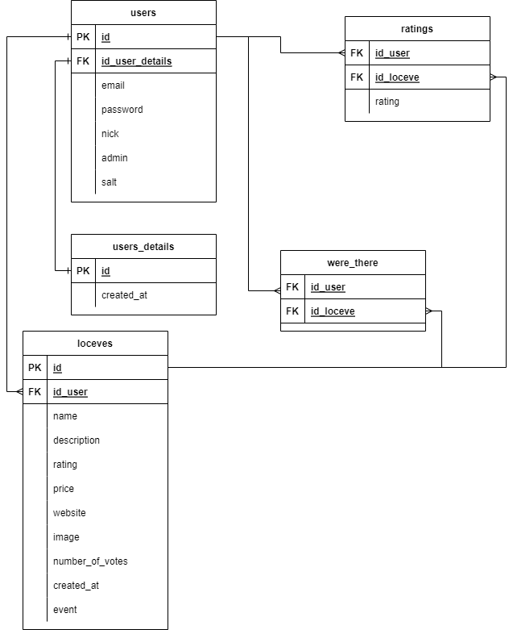

<p align="center">

</p>

# DRAW AND GO

A web application where you can browse, draw and rate locations and events.


# Technologies
- PHP
- JS
- HTML/CSS
- PostgreSQL


# Requirements
- [Docker](https://www.docker.com/)


# Installation

1. Clone the repository from Github:

```
git clone https://github.com/pepeni/DrawAndGo.git
```

2. Create an .env file, which includes database connection details.

```
DB_NAME=
DB_USER=
DB_PASSWORD=
DB_HOST=
```

3. Create an config.php file, which also includes database connection details.

```
<?php
DB_NAME=''
DB_USER=''
DB_PASSWORD=''
DB_HOST=''
```

4. Open terminal and run commands:

```
docker-compose build
```

```
docker-compose up
```

5. Access it by visiting http://localhost:8080 in your web browser.


# Database

